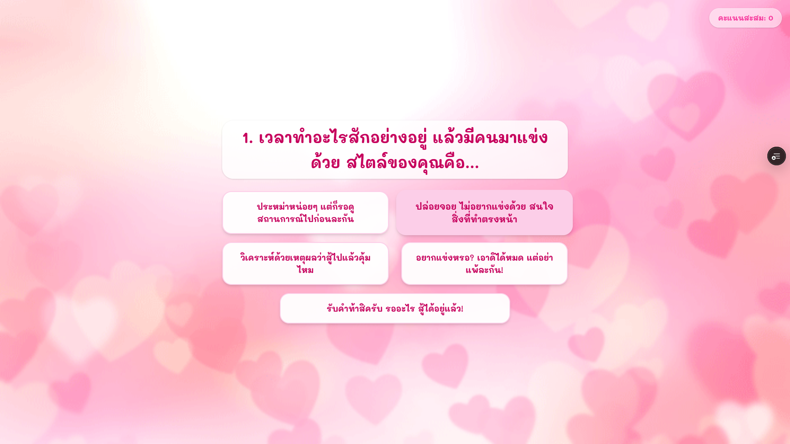

<h1 align="center">
  🛸 ✨ Seme Or Uke ✨ 🎮
</h1>

<p align="center">
  <b>SEME</b> &nbsp;&middot;&nbsp; <i>Or</i> &nbsp;&middot;&nbsp; <b>UKE</b>
</p>

## 📸 App Screenshots

### 🏠 Home Page

<p align="center">
  
</p>

### 🧠 2. Quiz & Question Page

<p align="center">
  
</p>

## 🎮 How to Play

Follow these simple steps to experience the quiz:

1. **Start the Quiz**: Click the start button on the landing page to initialize your session.
2. **Answer Honestly**: Progress through the interactive questions. Select the choices that best describe your personality or behavioral reactions.
3. **Reveal Your Identity**: Upon completion, the system instantly calculates your score and renders your final role profile using a dynamic typewriter animation effect.
4. **View Live Statistics**: Check how your result matches up against the entire community via the global real-time scoreboard.

## ⚙️ Game Rules & System Conditions

To ensure system integrity and accurate scoring, the application operates under the following architectural rules:

### 1. Score Capping Rule

- The total calculated score is strictly capped at a maximum of **40 points** (`MAX_SCORE = 40`).
- Any evaluated calculation exceeding this limit will automatically scale down to 40 using a safe mathematical boundaries function (`Math.min`).

### 2. Live Aggregation & Role Classification

The system queries the backend database and groups the community counts based on specific keywords found in the user results:

- **Seme (เมะ)**: Accumulated whenever the result identity string includes the keyword "เมะ".
- **Uke (เคะ)**: Accumulated whenever the result identity string includes the keyword "เคะ".
- **Neutral**: Fallback category assigned to any unexpected data entries or neutral role variations.

### 3. Session Guard & Route Protection (Security)

- Users are strictly forbidden from bypassing the quiz to access the results screen directly.
- The application implements a client-side route guard using `sessionStorage`. If `user_score` is completely missing (`null`) or contains corrupted/malicious payloads (`NaN`), the system initiates an immediate hard-reset and pushes the client back to the root entry path (`router.replace("/")`).

---

## 🛠️ Tech Stack & Badges

<p align="left">
  
  
  
  
  
</p>

### 🖥️ Frontend

- **Framework:** Next.js 16 (App Router with React Server Components)
- **Core Library:** React 19 (Advanced Hooks & Performance Optimizations)
- **Language:** TypeScript (Strict Type-Safety)
- **Styling & Design:** Tailwind CSS v4 (PostCSS Optimized) + Shadcn UI (Radix Primitives)
- **Animation:** Framer Motion (Fluid Layout Transitions)
- **State Management:** Native React Hooks with Browser `sessionStorage`

### ⚙️ Backend & Database

- **Framework:** Next.js Route Handlers (Built-in Serverless API Endpoints)
- **Database:** MongoDB (Native Node.js Driver Integration)
- **Architecture:** Monolithic Full-Stack Structure with Server/Client separation boundaries

---

## 🚀 Getting Started

Want to contribute, tweak the quiz logic, or just run the project locally? Follow these instructions to get a copy of the project up and running on your machine!

### Prerequisites

Before you begin, make sure you have the following installed:

- **[Node.js](https://nodejs.org/)** (v18.17 or higher recommended for Next.js 16)
- **npm** (comes with Node.js), **yarn**, or **pnpm**
- **[MongoDB](https://www.mongodb.com/atlas/database)** (A free MongoDB Atlas cluster or a local instance for storing quiz statistics)

---

### 1. Clone the Repository

First, clone the project to your local machine and navigate into the directory:

```bash
git clone https://github.com/neo-woupier/semeoruke.git
cd semeoruke
```

### 2. Install Dependencies

Install all the required packages (React, Tailwind, Framer Motion, etc.) using your package manager:

```bash
npm install
```

### 3. Configure Environment Variables

This application requires a MongoDB connection to store and aggregate quiz statistics in real-time.

- Create a new file named .env.local in the root directory.
- Open .env.example to see the required configuration.
- Paste your MongoDB connection string into your .env.local file:

```bash
MONGODB_URI=mongodb+srv://<username>:<password>@cluster...
```

### 4. Run the Development Server

Start the local Next.js development server with hot-reloading enabled:

```bash
npm run dev
```

### 5. Open and Explore 🎮

Open your favorite browser and navigate to:

```bash
http://localhost:3000
```

---

## 📂 Project Structure

Here is a quick overview of your repository's key directories and core configuration files:

### 🖥️ Frontend Architecture

```bash
├── 📂 app/                  # Next.js App Router (Client views & layout)
│   ├── 📂 globals.css       # Global styling integrated with Tailwind CSS v4
│   ├── 📂 page.tsx          # Main quiz landing page component
│   └── 📂 quiz              # Core quiz module wrapper
│       ├── 📂 q1 - q7       # Sequential quiz question routes (Steps 1 to 7)
│       └── 📂 q8            # Final question route & transition handler before results
├── 📂 components/           # Reusable UI components (Shadcn UI & custom elements)
├── 📂 public/               # Static assets (Images, screenshots, icons)
```

### ⚙️ Backend & Configuration Layer

```bash
├── 📂 app/api/              # Backend API routes (Serverless endpoints like /api/status)
├── 📂 lib/                  # Server utilities (Native MongoDB connection helpers)
├── 📂 .env.example          # Template schema for environment variables
├── 📂 components.json       # Shadcn UI path and style alias configuration
├── 📂 next.config.ts        # Next.js framework system custom options
└── 📂 package.json          # Project metadata, script commands, and dependencies
```

---

## 📖 เอกสารเชิงลึกสำหรับนักพัฒนา (Developer Documentation)

- [รายงานการปรับปรุงสถาปัตยกรรมและระบบคะแนน](./docs/architecture-redesign.md)
